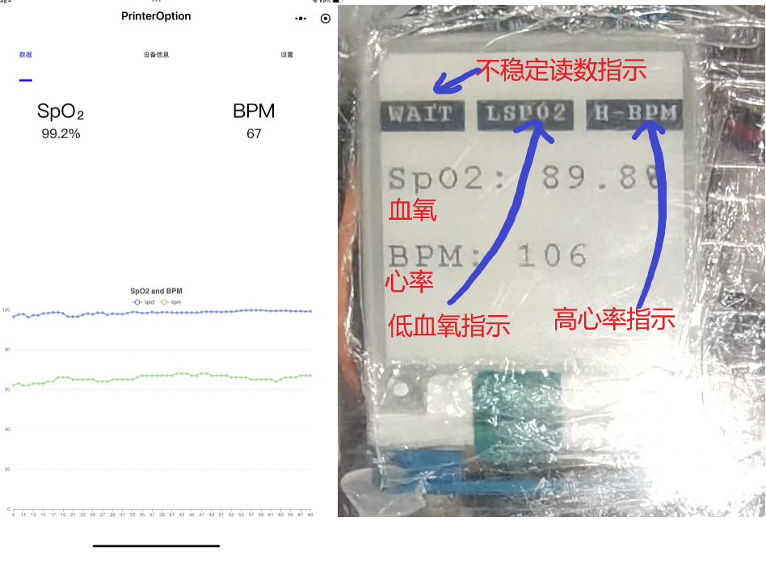
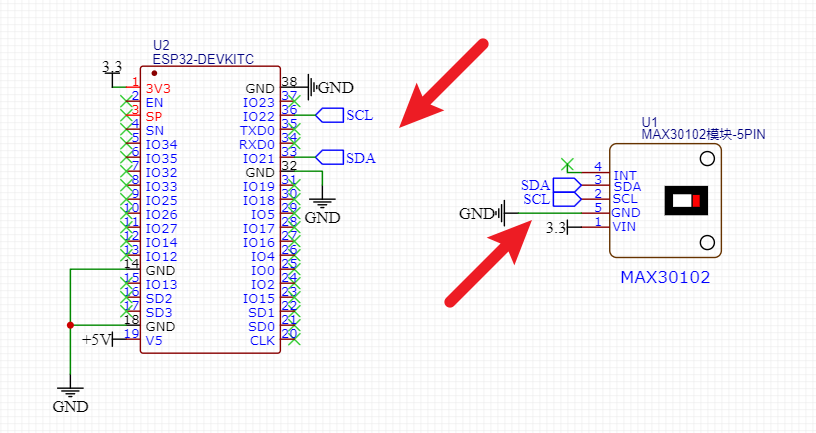
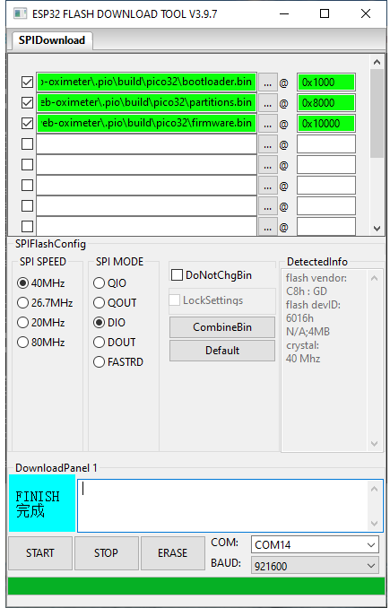
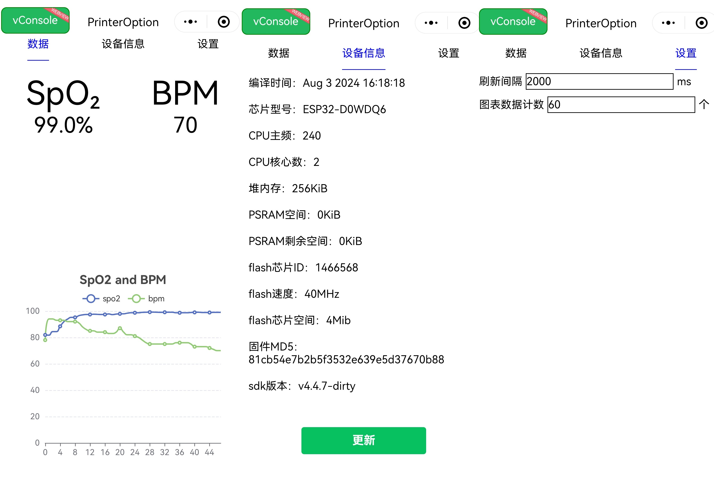

# ESP32 MAX30102 BLE血氧仪

> [!important]
>
> 本项目是[web血氧仪](https://github.com/createskyblue/esp32-web-oximeter)的一个fork，去除了原项目的web服务器、ftp服务器和文件系统部分（ffat）,改为使用ble传输数据，添加了一个小显示屏，并提供了配套的微信小程序代码。
> 
> 感谢原作者`createskyblue`!



## 注意

不对本项目的心率和血氧读数精度作出任何保障，不对本项目的稳定性和可靠性负责，不对本项目引发的健康问题负责，不能直接将本项目作为医疗产品使用，绝不对本项目提供任何担保。

## 所需设备

+ esp32开发板x1
+ MAX30102模块x1
+ LuatOS 1.54" 电子墨水屏x1（或微雪1.54''墨水屏，但需要更换驱动里的针脚定义，见下文）

## 硬件连接

### MAX30102

| MAX30102 | ESP32 |
| -------- | ----- |
| 3V3      | 3V3   |
| GND      | GND   |
| SCL      | 22    |
| SDA      | 21    |



(上图来源：https://github.com/createskyblue/esp32-web-oximeter/)

### 水墨屏(LuatOS)

| 水墨屏 | ESP32(GPIO) |
| ------ | ----------- |
| VCC    | 5V          |
| GND    | GND         |
| BUSY   | 25          |
| RES    | 26          |
| DC     | 27          |
| CS     | 15          |
| SCL    | 18          |
| SDA    | 23          |

注意：该驱动由微雪1.54寸水墨屏驱动修改而来，见：[Arduino框架下ESP32/ESP8266+合宙1.54“ 电子墨水屏（e-paper）驱动显示示例](https://blog.csdn.net/weixin_42880082/article/details/126478662)，因此理论上同样能够驱动微雪的1.54寸屏幕，只需要将代码中的针脚定义换回微雪的即可。可在微雪官方网站上查找到相关信息或下载驱动：[E-Paper ESP32 Driver Board - Waveshare Wiki](https://www.waveshare.net/wiki/E-Paper_ESP32_Driver_Board)

## 烧录

从release中下载产物后，按如下配置烧录即可。重启开发板后即可使用



## 手动编译

使用vscode打开本项目，并安装PlatformIO插件，将程序下载到esp32并重启后即可使用。

对于小程序部分，使用微信开发者工具打开`wx-frontend`，进行常规的编译、上传即可。



## Q&A

### Q: MAX30105 无法正常使用

A: 您需要在cal_BPM_SpO2.h中修改代码

```
//CUSTOM DEFINITION
//#define MAX30105 //if you have Sparkfun's MAX30105 breakout board , try #define MAX30105
```

为

```
//CUSTOM DEFINITION
#define MAX30105 //if you have Sparkfun's MAX30105 breakout board , try #define MAX30105
```

然后重新编译代码并下载到ESP32中，关于该部分的解释请查看

https://github.com/coniferconifer/ESP32_MAX30102_simple-SpO2_plotter

